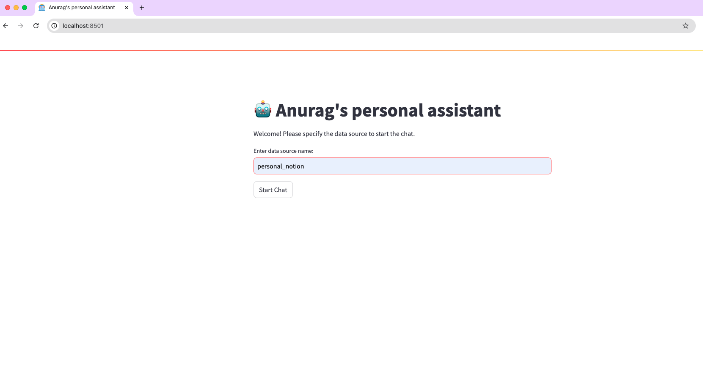
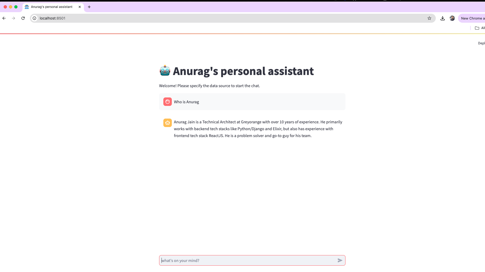
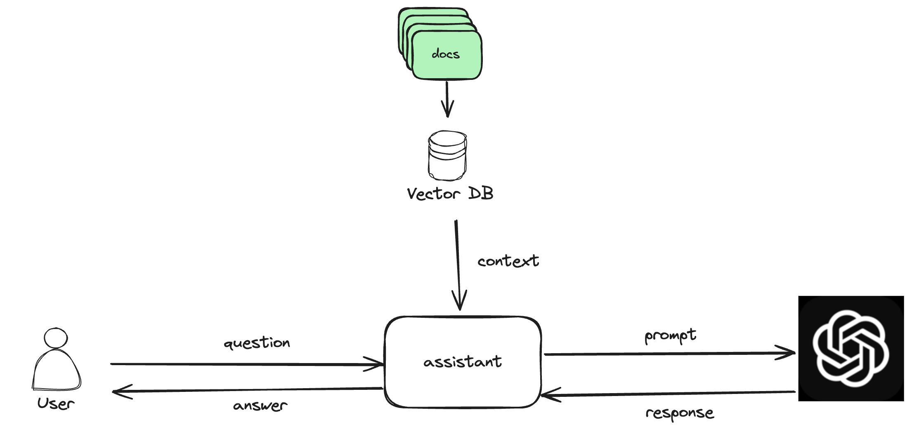

# AI Assistant 
It's an attempt to learn how to take advantage of LLM and create a better product.

## Demo
1. **Select the Data Source**  
   Choose the data source for querying.

   

2. **Ask the Assistant**  
   Interact with the assistant by asking questions related to your selected data source.

   


## Installation
To set up the AI Assistant, follow these steps:

1. Install required dependencies:
   ```bash
   pip install -r requirements.txt
   ```
2. Obtain an API key from Google and copy to .env file
   ```bash
   cp env_sample .env
   ```
3. Create the necessary directories:
   ```bash
   mkdir -p data/personal_notion metadata
   ```
4. Copy your documents into the `data/personal_notion` folder.
5. Convert documents to a vector database:
   ```bash
   python data.py
   ```
6. Launch the application:
   ```bash
   streamlit run app.py
   ```

## Let's Understand Architecutre
When you run `python data.py`, it converts the documents into a vector database. Whenever you ask a question, the system retrieves relevant context from the vector database and sends it to the LLM using a structured prompt.




## TechStack
1. LangChain
2. ChromaDB
2. StreamLit
3. Google Gemini

## Potential Use Cases
Here are a few ways you can utilize LLMs for different projects:
1. **Configuration Generator**  
   Automatically generate configurations based on input data.
   
2. **NLP to SQL**  
   Convert natural language queries to SQL statements.

3. **Document Summarizer**  
   Summarize lengthy documents into key points.

4. **Teacher**  
   Use the assistant to answer educational questions and help with learning.

You can extend the LLM by integrating custom tools and functions, giving it access to specific data and functionalities based on your needs.
